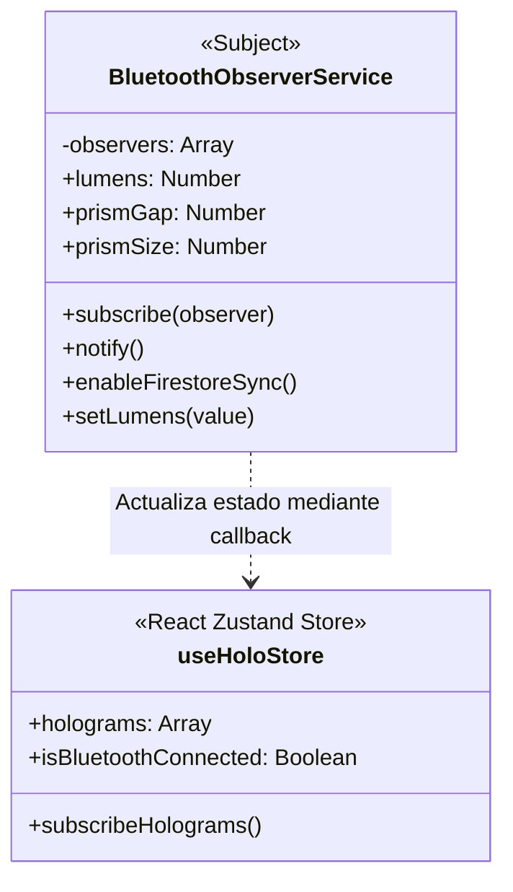

# 📘 Manual de Arquitectura de Código y Guía de Documentación - Vitra Holo App

Este documento proporciona una **explicación profunda del código fuente** de la aplicación **Vitra Holo**, detallando la arquitectura de componentes, las integraciones con servicios en la nube, el motor óptico de proyección y las mejores prácticas para generar y extraer documentación automatizada del proyecto.

---

## 📂 1. Estructura General del Proyecto

El proyecto está diseñado bajo un estándar moderno de Single Page Application (SPA) utilizando **React**, **Vite**, **Zustand** y **Firebase**. A continuación, se detalla el mapa del repositorio:

```bash
d:\Proyecto_Final_DM\
├── .firebase/                  # Metadatos del compilado de Firebase
├── public/                     # Recursos estáticos públicos (logo, iconos, manifest)
├── src/                        # Código fuente principal de la aplicación
│   ├── assets/                 # Estilos, fuentes e imágenes internas
│   ├── components/             # Componentes reutilizables
│   │   ├── Layout/             # Estructura visual de navegación (AppShell.jsx)
│   │   ├── AuthGuard.jsx       # Componente de protección de rutas privadas
│   │   └── GlobalProgressToast.jsx # Indicador flotante global para tareas en background
│   ├── config/                 # Configuraciones externas
│   │   └── firebase.js         # Inicialización de Firebase Auth, Firestore y Storage
│   ├── pages/                  # Vistas principales de la aplicación
│   │   ├── Dashboard.jsx       # Panel de control de bienvenida
│   │   ├── Gallery.jsx         # Visualización y borrado de hologramas creados
│   │   ├── Generate.jsx        # Pipeline de creación de hologramas (IA y Cargas)
│   │   ├── Login.jsx           # Autenticación segura de usuarios
│   │   ├── Project.jsx         # Panel de proyección y calibración local/BLE
│   │   ├── ProjectRemote.jsx   # Vista de proyección inalámbrica (espejo yWake Lock)
│   │   └── Settings.jsx        # Configuración de cuenta, enlace QR y depuración
│   ├── services/               # Clases de lógica de negocio y APIs
│   │   ├── bluetoothService.js # Singleton Observer para BLE y sincronización Firestore
│   │   └── geminiService.js    # Conectividad con Google Imagen 4.0 e IA Simulada
│   ├── store/                  # Gestión de estados reactivos
│   │   ├── useAuthStore.js     # Estado de sesión de usuario de Firebase Auth
│   │   └── useHoloStore.js     # Estado global de hologramas, lúmenes y Bluetooth
│   ├── utils/                  # Funciones de utilidad pura y procesamiento matemático
│   │   └── canvasProcessor.js  # Lógica auxiliar de procesamiento de imágenes
│   ├── App.jsx                 # Rutas de navegación principales de la app
│   ├── main.jsx                # Inicialización del árbol DOM de React y service workers
│   └── index.css               # Definición de tokens de diseño y variables globales CSS
├── tailwind.config.js          # Configuración del motor TailwindCSS y DaisyUI
├── vite.config.js              # Configuración de compilación ultrarrápida de Vite
└── firebase.json               # Configuración de despliegue en la nube
```

---

## 🧠 2. Análisis Detallado del Código Clave

### A. El Motor de IA y Carga Multipropósito (`src/services/geminiService.js` y `src/pages/Generate.jsx`)

La creación de contenidos cuenta con dos pipelines robustos: **Generación por IA** y **Carga Directa**.

#### 1. Generación por IA (Google Imagen 4.0 + Fallback de Pollinations AI):
En `geminiService.js`, la función `generateBaseImage` procesa los prompts. Para garantizar que las imágenes funcionen en el prisma holográfico, inyecta automáticamente reglas ópticas en el prompt del usuario:
* **Prompt Optimizado:** Agrega etiquetas como `3D digital asset floating on a solid black background (#000000)`, `pitch black background`, `centered composition` e `high-contrast`. Esto asegura que los bordes de la imagen se difuminen en negro absoluto, eliminando brillos no deseados en las caras del vidrio.
* **Pipeline de Fallback Dinámico:** Si la API Key de Gemini no está configurada o se superan los límites de cuota (error HTTP 429), el servicio captura la excepción y redirige la solicitud de forma silenciosa hacia **Pollinations AI**, generando una imagen real y coherente al prompt ingresado mediante Wildcard CORS Headers.

```javascript
// Pipeline de Resiliencia en geminiService.js
export const generateBaseImage = async (userPrompt, style = 'Cyberpunk') => {
  const apiKey = import.meta.env.VITE_GEMINI_API_KEY;
  if (!apiKey) return await executeFallbackSimulation(userPrompt, style, "API Key Missing");

  const optimizedPrompt = `${userPrompt}, style: ${style}, 3D digital asset floating on a solid black background (#000000)...`;
  try {
    const response = await fetch(`https://generativelanguage.googleapis.com/...predict?key=${apiKey}`, { ... });
    // Procesamiento de bytes en base64 ...
  } catch (error) {
    return await executeFallbackSimulation(userPrompt, style, error.message);
  }
};
```

#### 2. Carga Local y Conservación del GIF Animado:
Al subir archivos en `Generate.jsx`, el sistema sube la imagen original directamente a **Firebase Storage**. 
> [!NOTE]
> **Preservación de GIFs:** Para evitar el problema clásico de la web donde procesar imágenes animadas con Canvas de HTML5 "congela" el primer fotograma, omitimos deliberadamente la manipulación del canvas en el cliente durante la carga. El archivo binario original se conserva intacto en la nube, y las rotaciones se gestionan dinámicamente mediante hojas de estilo CSS en el visualizador.

---

### B. Gestión del Estado Reactivo y Patrón de Observador (`src/store/useHoloStore.js` y `src/services/bluetoothService.js`)

Para desacoplar la interfaz gráfica de los protocolos de red y Bluetooth, implementamos el **Patrón Observer clásico** encapsulado en un Singleton.



1. **El Sujeto Singleton (`bluetoothService.js`):**
   Mantiene el estado físico de la proyección (intensidad lumínica, calibración central, tamaño de escala). Si se activa el modo de proyección remota, este servicio sincroniza cada modificación actualizando el documento del usuario en Firebase Firestore: `device_sync/{userId}`.
2. **El Observador Zustand (`useHoloStore.js`):**
   Zustand se suscribe al servicio de Bluetooth mediante una suscripción limpia del patrón observer:
   ```javascript
   bluetoothService.subscribe((bleState) => {
     useHoloStore.setState({
       isBluetoothConnected: bleState.isConnected,
       bluetoothDeviceName: bleState.deviceName,
       lumens: bleState.lumens,
       screenBrightness: bleState.screenBrightness,
     });
   });
   ```
   Cualquier cambio físico (por ejemplo, mover un slider en la pantalla de React o recibir una orden por red) fluye de forma asíncrona hacia Zustand, forzando un renderizado reactivo instantáneo en la UI.

---

### C. Motor Óptico de Proyección y Modo Espejo (`src/pages/Project.jsx` y `src/pages/ProjectRemote.jsx`)

Para crear la ilusión de un holograma suspendido dentro de un prisma de 4 lados, el lienzo central posiciona 4 elementos `` idénticos orientados hacia cada uno de los puntos cardinales.

```
                  ┌──────────────┐
                  │   TOP IMAGEN │
                  │  (Rotación)  │
                  └──────────────┘
                         ▲
   ┌──────────────┐      │      ┌──────────────┐
   │ LEFT IMAGEN  │◄─────┼─────►│ RIGHT IMAGEN │
   │  (Rotación)  │      │      │  (Rotación)  │
   └──────────────┘      ▼      └──────────────┘
                  ┌──────────────┐
                  │ BOTTOM IMAG. │
                  │  (Normal)    │
                  └──────────────┘
```

#### 1. Rotación y Modo Espejo (Esencial para Lectura Física)
Dado que las caras inclinadas de la pirámide física funcionan como reflectores planos (espejos), las imágenes en pantalla se reflejan invertidas. Si hay letras o figuras asimétricas, estas se leerían al revés. 
Para resolver esto, integramos transformaciones CSS inline combinando rotaciones con **inversión horizontal nativa (`scaleX(-1)`)**:

* **Cara Superior (Top):** Rotada 180 grados e invertida horizontalmente.
  ```javascript
  transform: 'rotate(180deg) scaleX(-1)'
  ```
* **Cara Inferior (Bottom):** Orientación base invertida horizontalmente.
  ```javascript
  transform: 'scaleX(-1)'
  ```
* **Cara Izquierda (Left):** Rotada 90 grados en el sentido de las agujas del reloj e invertida horizontalmente.
  ```javascript
  transform: 'rotate(90deg) scaleX(-1)'
  ```
* **Cara Derecha (Right):** Rotada -90 grados (270°) e invertida horizontalmente.
  ```javascript
  transform: 'rotate(-90deg) scaleX(-1)'
  ```

Esta composición vectorial garantiza que, independientemente de la inclinación del dispositivo de visualización, **el reflejo sobre el cristal se lea con total claridad y del derecho**.

#### 2. Calibración Central y Escala
En lugar de depender de imágenes estáticas rígidas, el software calcula la posición física de las proyecciones dinámicamente mediante los estados de calibración:
* **`prismGapValue` (Apertura Central):** Determina la distancia (`top`, `bottom`, `left`, `right` en porcentajes) con respecto al centro absoluto. Mover este slider expande el espacio negro central para ajustarlo a la base cuadrada de tu prisma físico (ej. 2x2 pulgadas).
* **`prismSizeValue` (Tamaño de Imagen):** Controla el ancho de los elementos `` en base a porcentajes (`width: ${prismSizeValue}%`), evitando que la proyección se salga del área útil de los cristales inclinados.

---

### D. Prevención de Reposo de Pantalla (Screen Wake Lock API)

En `ProjectRemote.jsx`, el dispositivo receptor (que suele estar posado bocarriba bajo la pirámide física) no recibe toques físicos directos, lo que provocaría que el sistema operativo apagara la pantalla por inactividad.

Para resolverlo de forma profesional, implementamos la API nativa de **Wake Lock**:
1. Al renderizar el proyector, se solicita un bloqueo en segundo plano de la pantalla:
   ```javascript
   const requestWakeLock = async () => {
     try {
       if ('wakeLock' in navigator) {
         wakeLock = await navigator.wakeLock.request('screen');
       }
     } catch (err) {
       console.warn(`Wake Lock error: ${err.message}`);
     }
   };
   ```
2. **Resiliencia de Foco:** Si el usuario minimiza el navegador, la API del sistema operativo libera el hilo de bloqueo de energía automáticamente para ahorrar batería. Por lo tanto, agregamos un escuchador de visibilidad (`visibilitychange`) que vuelve a adquirir el bloqueo de forma silenciosa e instantánea cuando el navegador vuelve a tener el foco en pantalla:
   ```javascript
   const handleVisibilityChange = () => {
     if (wakeLock !== null && document.visibilityState === 'visible') {
       requestWakeLock();
     }
   };
   ```

---

## 🔍 3. Cómo Obtener y Generar la Mayor Documentación del Código

Si deseas expandir esta documentación o generar de forma automatizada diagramas interactivos y páginas HTML auto-explicativas con toda la jerarquía de funciones, sigue estas estrategias técnicas:

### Opción A: Generación Automatizada de API Docs con JSDoc
El código fuente ya cuenta con comentarios estándar de tipo **JSDoc** (bloques `/** ... */` sobre las clases y métodos en los servicios). Puedes compilar una web de referencia técnica en segundos.

1. **Instalar JSDoc localmente en el proyecto:**
   Abre tu consola de comandos en el directorio raíz (`d:\Proyecto_Final_DM`) y ejecuta:
   ```bash
   npm install --save-dev jsdoc
   ```

2. **Agregar Script de Compilación de Docs:**
   Abre el archivo `package.json` y en la sección `"scripts"`, agrega el comando de documentación:
   ```json
   "scripts": {
     "dev": "vite",
     "build": "vite build",
     "lint": "eslint .",
     "preview": "vite preview",
     "docs": "jsdoc -c jsdoc.json"
   }
   ```

3. **Crear archivo de Configuración (`jsdoc.json`):**
   Crea un archivo llamado `jsdoc.json` en la raíz de tu proyecto con el siguiente contenido:
   ```json
   {
     "source": {
       "include": ["src/services", "src/store", "src/utils"],
       "includePattern": ".+\\.js(x)?$",
       "excludePattern": "(^|\\/|\\\\)_"
     },
     "opts": {
       "destination": "./docs",
       "recurse": true
     }
   }
   ```

4. **Ejecutar Generador de Documentación:**
   Genera el árbol estático HTML ejecutando:
   ```bash
   npm run docs
   ```
   Esto creará una carpeta llamada `docs/` en tu proyecto. Abre `docs/index.html` en cualquier navegador y tendrás un portal interactivo y ordenado con toda la documentación de clases, variables, métodos de sincronización y tipados de tu aplicación.

---

### Opción B: Inspección Dinámica desde VS Code
Para navegar rápidamente y comprender la jerarquía del código mientras desarrollas en Visual Studio Code:
1. **Vista de Esquema (Outline View):** Abre la barra lateral izquierda en VS Code, selecciona la pestaña del explorador y expande la sección inferior llamada **Outline** (Esquema). Te mostrará un mapa en árbol de todos los hooks, estados de Zustand, importaciones y funciones declaradas en el archivo actual.
2. **Navegación Rápida (`Ctrl + Shift + O`):** Presiona esta combinación de teclas dentro de cualquier archivo en VS Code para abrir un buscador de símbolos. Escribe el nombre de la variable o método para saltar a su definición exacta al instante.
3. **Búsqueda por Referencias (`Shift + Alt + F12`):** Posiciónate sobre el nombre de cualquier función (como `enableFirestoreSync`) y presiona esta combinación de teclas para ver en qué otras páginas se está importando o ejecutando.

---

### Opción C: Consultas Guiadas con IA (Prompting Efectivo)
Dado que tu agente de inteligencia artificial posee herramientas de lectura profunda del repositorio, puedes solicitar resúmenes focalizados en cualquier momento. Algunos ejemplos de prompts eficaces que puedes utilizar en esta consola de chat son:

* *"Explícame paso a paso cómo viaja un cambio de brillo desde el slider del teléfono hasta que se renderiza en la pantalla de la tablet."*
* *"Dame una guía detallada del ciclo de vida de autenticación en `useAuthStore.js` y cómo reacciona el componente `AuthGuard.jsx`."*
* *"Haz una propuesta técnica para añadir una quinta cara en la pantalla de proyección que mire hacia abajo si quisiéramos cambiar a un prisma piramidal invertido de cinco lados."*
